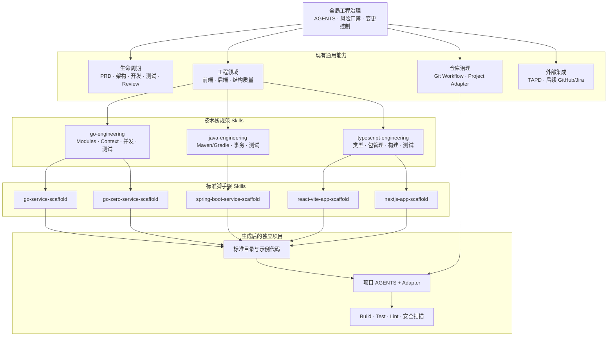
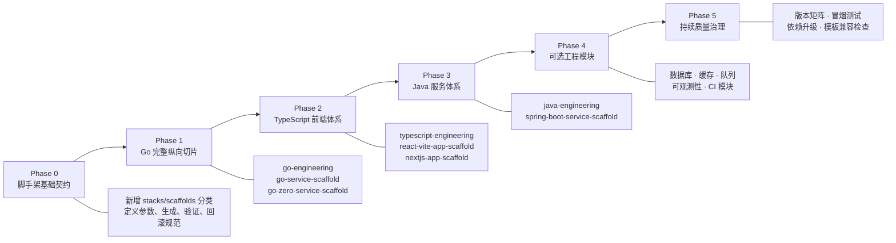

# Agent 工程能力建设路线图

本文是 Agentic Development Workflow 后续能力建设的唯一规划来源。目标是在现有工程治理基础上，逐步形成“通用工程方法、技术栈规范、标准脚手架、项目适配、验证交付”的完整体系。

## 能力地图



前端、后端属于工程领域；Go、Java、TypeScript 属于技术栈；Spring Boot、React/Vite、Next.js、Go-Zero 属于明确命名的框架脚手架。三者保持独立 Owner，通过组合完成项目生成，避免为每种依赖组合创建一个新 Skill。

典型组合：

```text
ax-backend
    + go-engineering
    + go-service-scaffold
    + ax-project-adapter
```

## 建设路线



## 阶段交付

| 阶段 | 核心交付 | 完成标准 |
|---|---|---|
| Phase 0 | `stacks`、`scaffolds` 分类与统一脚手架契约 | catalog、安装、验证和回滚边界明确 |
| Phase 1 | Go 规范与服务脚手架 | 临时工程可生成，并通过 build、test 与项目适配验收 |
| Phase 2 | TypeScript 规范与前端脚手架 | React/Vite、Next.js 变体边界明确且可独立构建 |
| Phase 3 | Java 规范与 Spring Boot 脚手架 | Maven/Gradle 选择、事务和测试边界可验证 |
| Phase 4 | 可组合工程模块 | 数据库、缓存、队列、可观测性与 CI 不复制基础脚手架 |
| Phase 5 | 持续兼容治理 | 版本矩阵、冒烟测试和依赖升级流程可执行 |

## 脚手架统一门禁

每个脚手架必须满足：

- 输入参数和目标路径经过校验，默认拒绝覆盖非空目录。
- 在临时目录完成生成与验证，成功后才交付最终结果。
- 不包含密钥、个人路径、具体产品名称和环境专属配置。
- 生成结果可以独立执行 build、test 和 lint。
- 通过 `ax-project-adapter` 建立项目自己的 `AGENTS.md`、Owner 和验证入口。
- 失败不留下半成品，并提供精确恢复方式。
- 框架脚手架显式命名，不把单一框架定义成通用标准。

## 第一优先级

先完成 Go 的完整黄金路径：

```text
scaffold contract
    -> go-engineering
    -> go-service-scaffold
    -> 临时项目生成
    -> build/test
    -> project-adapter
    -> 独立会话验收
```

Go 纵向切片通过后，再复用已验证的模式建设 TypeScript 和 Java，避免同时设计多套未经验证的抽象。
