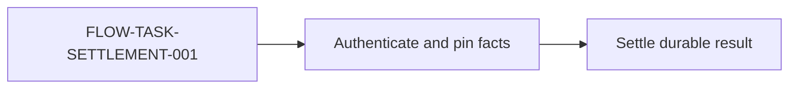

# Domain SDD Model

本文件是 `ax-sdd` 的唯一模型定义。工具、模板、项目采用和业务验收必须服从本文件；旧 profile、context route Schema、coverage 和分层校验已删除，不提供兼容路径。

## 目标与适用范围

Domain SDD 定义项目全部 current behavior：可观察行为、公开和内部契约、数据、不变量、运行与运维边界、验收边界以及声明的固定资产。它适用于任何规模的项目，不以大型项目、文件数量、团队规模或单次任务作为采用条件。

Domain 是项目 SDD 的稳定组织、Owner 和导航单位，不是规范覆盖范围。按任务读取“最小充分上下文闭包”只是控制读取预算；未被本次任务读取的项目行为仍由其 current Artifact 定义。

## 非目标

- 不复制 OpenSpec 或 Spec Kit 的 CLI、分支、目录编号、阶段命令或工作流状态机。
- 不保存 Proposal、任务清单、进度、会议记录、Agent 推理、被否决方案或历史快照。
- 不逐行复制源码、函数调用图、代码测试实现或偶然缺陷。
- 不以项目规模、文件数量、单次需求或团队临时分工机械决定是否采用 SDD 或建立 Domain；Domain 拆分必须由真实的独立目的和边界驱动。
- 不维持旧 SDD Schema、别名、自动迁移器或双写兼容层。

## 术语与身份

| 概念 | 定义与边界 |
| --- | --- |
| Domain | 项目 SDD 中具有稳定业务目的和 Owner 的规范边界。它至少拥有独立生命周期、数据/权限、事务、外部副作用、失败恢复、跨团队合同或独立可验证结果之一；Domain 组织整个项目的规范内容，而不是只覆盖一个最小领域。 |
| Subdomain | 父 Domain 内仍具有独立目的和局部闭包的 Domain。父 Domain 只保存跨子领域结果与编排。 |
| Domain Index | `index/domains.json`；唯一的 Domain 导航图，登记 Domain 身份、父子关系、Artifact 和依赖，不保存规范正文。 |
| Supporting lookup roots | Domain Index、Dictionary 和 Traceability 是导航入口；只有 Domain Index 决定 Domain 路由，Dictionary/Traceability 只用于术语与 Requirement/Oracle 反查。 |
| Domain PRD | Domain 的 why：Actor 价值、Journey、范围、非目标和成功结果。 |
| Domain SPEC | Domain 的 what：可观察行为、业务规则、状态结果、参数用途和特殊要求。 |
| Logic Flow | Domain 的稳定 how：触发、责任链、事实变化、调用、副作用、失败与恢复；不是函数调用图。 |
| Test Flow | Domain 的 proof 路由：Journey、Requirement、Logic Flow、边界案例、证据层和 Acceptance Boundary；不是代码测试源码。 |
| Dictionary Term | 仅限 subject object 或 logic term；必须具有稳定身份/生命周期或跨 Requirement 复用价值。 |
| Requirement | 带稳定 `REQ-*` ID 的当前规范约束；只有一个 canonical Owner。 |
| Acceptance Boundary | 带稳定 `ORACLE-*` ID、与 Agent 无关的公开通过/失败合同；可保护多个共享判定边界的 Requirement。 |
| Change Delta | 一次变更相对 current truth 的 ADDED/MODIFIED/REMOVED/RENAMED 差异；不进入 current SDD。 |
| Architecture overview | Architecture Artifact 内的 Mermaid 非规范投影；只压缩系统边界、Owner、依赖方向和外部副作用，不能拥有新的 Requirement。 |
| Flow overview | Logic Flow Artifact 内的 Mermaid 非规范投影；每个 `FLOW-*` 恰有一个可搜索节点，并与同文件 Main flow 表格保持相同主顺序。 |

Requirement 的 canonical Owner 是 Domain ID，显式记录在 traceability；同一 Requirement 可以引用该 Domain 的 SPEC 与支持它的技术合同，不以 Artifact 文件 owner 数量推导 Owner。

## 唯一目录结构

```text
sdd/
├── manifest.json
├── index/
│   └── domains.json
├── domains/
│   └── <domain-id>/
│       ├── domain.json
│       ├── prd.md
│       ├── spec.md
│       ├── logic-flow.md
│       ├── test-flow.md
│       └── <subdomain-id>/
│           └── ...
├── dictionary/
│   ├── objects.md
│   └── logic-terms.md
├── contracts/
├── data/
├── architecture/
├── operations/
├── quality/
├── acceptance/
│   └── traceability.json
└── assets/
```

约束：
- `domains/` is the default human entrypoint; `index/domains.json` is the machine navigation entrypoint. Together with the registered supporting Artifacts, they cover the adopted project's current behavior; task routing may read only a sufficient subset.
- Each Domain must own PRD, SPEC, at least one Logic Flow Artifact and at least one Test Flow Artifact. The project SDD is complete at the project level even when one small project uses a single Domain.
- `contracts/`, `data/`, `architecture/`, `operations/`, `quality/` save cross-Domain or precise technical contracts.
- `acceptance/` saves public Acceptance Boundaries; `assets/` saves non-derivable fixed bytes.
- Empty technical directories may exist without registration; all ordinary files must be registered in the manifest.
- `proposal`、`task`、`plan`、`history`、`archive`、`source` 和 `src` 路径段禁止出现在 SDD。
- 不建立 `diagrams/`、`flows/` 或图索引；Mermaid 源码必须与其投影的 Architecture/Logic Flow 规范同文件。PNG、SVG、截图或外部白板只能是发布展示物，不能成为 SDD current truth。

## Manifest 合同

唯一 profile：

```json
{
  "schema_version": 1,
  "profile": "domain-sdd"
}
```

根字段只允许：

- `schema_version`
- `profile`
- `system`
- `artifacts`
- `domain_index_artifact`
- `traceability_artifact`

`domain_index_artifact` 和 `traceability_artifact` 必须分别指向唯一的 `domain-index` 与 `traceability` Artifact；两者必须存在，路径分别为 `index/domains.json` 与 `acceptance/traceability.json`，并与 `system.status` 保持一致。`system.status` 为 `current` 时，两者必须为 `current`；`artifacts` 中不得再声明第二个 Domain Index 或 Traceability 根。
`system`：

```json
{
  "id": "example-system",
  "name": "Example System",
  "version": "0.1.0",
  "status": "draft"
}
```

`status` 只允许 `draft` 或 `current`。

Artifact 字段：

- 必需：`id`、`kind`、`path`、`status`、`owner`
- 可选：`references`，登记该 Artifact 规范拥有或验证所需的直接子 Artifact ID；值必须唯一、存在、不得自引用，整个引用图必须无环
- `asset` 额外必需：`sha256`、`source`、`license`
- 未声明 `references` 时视为空数组；其他未知字段禁止

允许的 kind：

```text
domain-index domain-metadata prd specification logic-flow test-flow dictionary
contract data architecture operation quality ui acceptance traceability asset
```


旧 profile 或未知字段直接失败。Manifest 的两个根字段缺失、指向错误 kind/status/path，或声明重复导航根时直接失败。

## Domain Index 合同

`index/domains.json`：

```json
{
  "schema_version": 1,
  "role": "domain-navigation",
  "default_domain": "task-control",
  "domains": [
    {
      "id": "task-control",
      "label": "Task Control",
      "owner": "task-control",
      "parent": null,
      "children": [],
      "purpose": "Owns Task admission, lifecycle and durable result behavior.",
      "artifacts": {
        "metadata": "DOMAIN-TASK-CONTROL-METADATA",
        "prd": "DOMAIN-TASK-CONTROL-PRD",
        "spec": "DOMAIN-TASK-CONTROL-SPEC",
        "logic_flows": ["DOMAIN-TASK-CONTROL-LOGIC"],
        "test_flows": ["DOMAIN-TASK-CONTROL-TEST"]
      },
      "terms": ["Task", "Task settlement"],
      "depends_on": ["capacity"],
      "contracts": ["CONTRACT-PUBLIC-TASK"],
      "data": ["DATA-TASK"],
      "supporting": ["ARCH-TASK-CONTROL", "ACCEPTANCE-TASK-CONTROL"]
    }
  ]
}
```

Domain Index 只保存身份和引用。禁止保存 Requirement 正文、Schema 字段、Logic Flow 步骤、业务验收案例、源码路径或当前任务。

静态校验必须验证：

- Domain ID 唯一且规范化；
- `default_domain` 是存在的 Domain ID；
- 父子关系双向一致且无环；
- `depends_on` 存在、无自依赖且依赖图无环；
- Domain Artifact 只被一个 Domain 拥有；
- Artifact owner 与 Domain owner 一致；
- `contracts` 和 `data` 引用正确 kind；
- Dictionary Term 已定义；
- `supporting` 只引用该 Domain 完整理解所需的 Architecture、Operations、Quality、UI 和 Acceptance Artifact；不得放源码路径或邻接 Domain 的全部文档；
- `domains/` 下所有领域 Artifact 都进入 Domain Index；
- Manifest Artifact 引用图合法，并且全部 Artifact 从导航根可达。

## Domain Metadata 合同

`domain.json` 是 Domain Index 的局部机器可读投影，不是第二份规范正文。以下身份字段必须与 Domain Index 的对应条目一致：`id`、`label`、`owner`、`purpose`、`parent`、`children`、`terms` 和 `depends_on`。

`domain.json` 的 `artifacts` 使用当前 Domain 目录内的相对路径；Domain Index 的 `artifacts` 使用 Manifest Artifact ID。校验时必须通过 Manifest 解析两者，并确认 `prd`、`spec`、`logic_flows` 和 `test_flows` 一一对应。Index 的 `contracts`、`data` 和 `supporting` 是全局导航引用，不要求在 `domain.json` 中复制。

示例：

```json
{
  "schema_version": 1,
  "id": "task-control",
  "label": "Task Control",
  "owner": "task-control",
  "purpose": "Owns Task admission, lifecycle and durable result behavior.",
  "parent": "system",
  "children": [],
  "artifacts": {
    "prd": "prd.md",
    "spec": "spec.md",
    "logic_flows": ["logic-flow.md"],
    "test_flows": ["test-flow.md"]
  },
  "terms": ["Task", "Task settlement"],
  "depends_on": ["system"]
}
```

不得增加项目路径、实现入口或第二份规范正文。

## Domain PRD

必需结构：

```markdown
# <Domain> PRD

## Purpose
## Actors and value
## User journeys
### Journey: <name>
- Priority:
- Goal:
- Independent outcome:
- Scope boundary:
## In scope
## Out of scope
## Success outcomes
```

PRD 不记录 API 字段、Schema、数据库、类、函数、Provider payload、配置名、验证命令或实现计划。

## Domain SPEC

必需结构：

```markdown
# <Domain> SPEC

## Purpose
## Requirements
### REQ-<DOMAIN>-001 — <observable behavior>
```

SPEC 保存可观察效果、业务规则、允许/默认/拒绝行为、状态结果、参数用途、权限、幂等、数据、安全和兼容边界。精确结构分别归 Contract、Data、Architecture 或 Operations。

每个 `REQ-*` 必须出现在 traceability 中。

## Logic Flow

必需结构：

```markdown
# <Domain> Logic Flows

## FLOW-<DOMAIN>-001 — <name>
### Purpose
### Trigger
### Preconditions
### Main flow
### Failure and recovery
### Side-effect boundaries
### Cross-domain dependencies
### Traceability
```

Main flow 记录 Owner、Action、事实/状态变化、调用和下一步。只有影响事务、权限、数据所有权、外部副作用或恢复语义的内部边界才进入 Logic Flow。

每个 Flow 必须引用已登记 Requirement。稳定跨 Domain 调用必须与 `depends_on`、Contract/Data 引用一致。

### Logic Flow 可视化投影

每份 Logic Flow Artifact 在标题和第一个 `FLOW-*` 之间必须有且仅有一个 `## Flow overview`：

````markdown
## Flow overview

> Non-normative visualization. The `FLOW-*` sections and Main flow tables are authoritative.


````

约束：

- 只允许 Mermaid `flowchart`，源码保持文本可搜索；不得使用图片替代。
- 每个同文件 `FLOW-*` ID 必须恰好出现在一个 Mermaid 节点标签中；节点标识符使用字母、数字和下划线，规范 ID 保留在引号标签内。
- 图只表达 Owner、主要阶段、durable fact、外部副作用和失败/恢复方向；详细前置条件、分支和规则留在 Flow 章节及 Main flow 表格。
- 图不得引入同文件 Flow、Domain Index、Contract/Data supporting 闭包中不存在的新 Owner、状态或依赖。
- 图与表格冲突时，Flow 章节和 Main flow 表格权威；`current` 校验必须拒绝缺图、重复 Flow ID 或引用未知 Flow ID 的图。

## Architecture 可视化投影

系统 Architecture Artifact 必须包含：

1. `## Architecture overview`：一个 Mermaid `flowchart`，显示入口、Application/Domain Owner、durable fact owner、外部 port 及副作用方向。
2. `## Domain dependency overview`：一个 Mermaid `flowchart`，每个 Domain ID 恰有一个节点；父子边与 `depends_on` 边必须来自 Domain Index，并用不同标签区分。

图是非规范投影，必须在图前声明表格、Requirement、Domain Index 和技术合同权威。Architecture 的文字边界和依赖表仍是 Agent 搜索、引用和审查的主要载体；不得把字段、业务验收案例或完整业务规则塞入图中。

## Business Test Flow

必需结构：

```markdown
# <Domain> Business Test Flows

## TEST-<DOMAIN>-001 — <acceptance goal>
### Protects
- Journey:
- Requirements:
- Logic flows:
### Preconditions
### Observable checks
### Boundary cases
### Evidence layer
### Acceptance boundaries
### Verification entrypoints
```

业务 Test Flow 必须引用有效 Journey、Requirement、Logic Flow 和 Oracle。证据层可以是 focused、contract、integration、manual 或 release。它不记录代码、类、函数、fixture、mock、覆盖率或实现分支，也不把每个 Requirement 机械映射为独立 Oracle。

## Dictionary

允许两类条目：

```markdown
## Task
- Kind: subject object
```

```markdown
## Task settlement
- Kind: logic term
```

禁止：API 字段、DTO、Schema、数据库列、输入输出结构、参数、环境变量、Provider payload、fixture 字段、局部类型、helper 和 UI-only 状态。

## Technical Artifact Owner

- `contract`：API、事件、错误、权限、协议和兼容结构。
- `data`：Schema、生命周期、一致性、迁移和恢复数据合同。
- `architecture`：模块、依赖、Provider payload、缓存、并发和内部协议。
- `operation`：配置、部署、观测、备份、恢复和回滚。
- `quality`：安全威胁模型、性能、可靠性、容量和兼容目标。

技术 Artifact 可以参与 Requirement 的完整规范，但 Requirement 的唯一 canonical Owner 是 traceability 显式记录的 Domain ID；Artifact 自身 owner 表示文档维护边界，不推导或复制 Requirement Owner。

## Traceability 与 Acceptance

`acceptance/traceability.json`：

```json
{
  "schema_version": 1,
  "requirements": [
    {
      "id": "REQ-TASK-001",
      "owner": "task-control",
      "artifacts": ["DOMAIN-TASK-SPEC", "ARCH-TASK-CONTROL"],
      "oracles": ["ORACLE-TASK-001"]
    }
  ],
  "oracles": [
    {
      "id": "ORACLE-TASK-001",
      "artifact": "ACCEPTANCE-TASK"
    }
  ]
}
```

规则：

- Requirement 必须显式记录一个已登记 Domain ID 作为 canonical Owner；
- Requirement 必须真实出现在每个 normative Artifact 中；
- Oracle 必须真实出现在 acceptance Artifact 中；
- 每个 Requirement 至少一个 Oracle；
- 每个 Oracle 至少保护一个 Requirement；
- Artifact 中出现的 Requirement/Oracle 不得遗漏于 traceability；
- Acceptance Boundary 描述公开、实现无关、Agent 无关的可观察通过/失败条件。

## Domain 导航

Agent 从 Domain Index 开始导航；Dictionary 与 Traceability 只用于术语或 Requirement/Oracle 反查：

1. 先按任务中的操作目标、被改变的 Requirement Owner、持久事实 Owner 和外部副作用 Owner 确定一个 primary Domain；Domain ID、label、purpose 和 Dictionary Term 只提供候选证据，重合 Term 不能单独决定归属；primary Domain 是本次导航起点，不是项目 SDD 的全部范围；
2. 若任务明确改变其他 Domain 拥有的行为、状态、不变量、数据、权限或外部副作用，把它们登记为 affected Domains，并分别读取最小充分上下文闭包；仅调用依赖但不改变其合同，不自动扩大为 affected Domain；
3. primary 候选并列且会改变编辑或验证范围时，必须从 canonical Owner/Requirement 证据消歧；不得静默使用 `default_domain`。`default_domain` 只用于无匹配的只读初始导航，并必须标记为默认选择；
4. 对 primary 和每个 affected Domain 读取完整的最小充分上下文闭包：Domain Index、Dictionary、Domain Metadata、PRD、SPEC、Logic Flow、Test Flow、直接 Contract/Data、相关 Acceptance、traceability，以及任务触及的 Manifest `references`；这是读取范围，不是 SDD 的项目覆盖范围；

只有 `current` SDD 可以作为当前系统导航入口。

## 采用前置检查与交接结果

- 进入 Domain SDD 前，先确认目标仓库的 `AGENTS.md` 明确采用项目级 Domain SDD，且现有 `manifest.json` 与 `index/domains.json` 被项目规则声明为 authoritative。任一条件不满足时，结果必须是 `out-of-sdd`，保留项目原有规格 Owner，不创建或同步 SDD 目录、Artifact、校验命令或 Domain 路由。

命中已采用的 SDD 后，每次处理返回以下最小交接字段：

```text
status: out-of-sdd | accepted | gap | blocked
classification: S1 | S2 | null
primary_domain: <domain-id> | null
affected_domains: [<domain-id>, ...]
closure: <actual files/artifacts read>
requirements: [REQ-...]
oracles: [ORACLE-...]
todo: required | not-required | frozen
blockers: <exact missing source or human decision>
```

`accepted` 只表示 current Spec、Owner、Oracle、Logic Flow 和直接依赖足以执行；不代表实现、项目门禁或发布已经通过。`gap` 必须给出缺失的 canonical source、Requirement、Oracle、Owner 或边界；`blocked` 必须给出冲突和所需人工决定。`ax-pipeline` 只消费该结果，不重建 SDD 路由或 Todo 合同。

## Change Delta

Change Delta 属于 `ax-pipeline`、PR/Issue 或默认搜索空间之外的临时任务上下文，不属于 current SDD。业务 Test Flow 若描述尚未实现的目标行为，也必须留在该临时上下文；只有对应 Spec、实现、projection、traceability 和 Acceptance Oracle 一并完成后，才可合并为 current Artifact。允许操作：

- `ADDED`
- `MODIFIED`
- `REMOVED`
- `RENAMED`

行为不变的重构可以省略规格 delta。行为变化先在任务上下文确认 Delta、primary/affected Domain 和 canonical Owner；不得把尚未实现或未接受的目标单独提交为 current truth。实现发现可以回改需求和设计，不设置不可返回阶段门。交付包必须原子地完成规范、实现、projection、traceability 和验证；交付前把已接受 Delta 合并到唯一 current Artifact，删除临时 Delta，只运行一次项目 SDD 验证入口。普通 SDD 内容变化不触发校验器回归、CI 模拟或其他项目门禁；仅模型/校验器实现变化运行其 focused 回归。

## Current 完整性

项目已有验证入口或交付审查必须检查：

- manifest/Profile/字段/kind/path/status；
- 文件全部登记且无 symlink/越界/禁止目录；
- Manifest `references` 合法、无环且所有 Artifact 从导航根可达；
- Domain Index、Domain Metadata、父子/依赖图；
- PRD/SPEC/Logic/Test 必需章节；
- 系统 Architecture 的 Mermaid 边界图和 Domain 依赖图；每份 Logic Flow 的 Mermaid 概览覆盖全部且仅覆盖已声明 `FLOW-*`；
- Dictionary kind；
- Requirement/Oracle/Flow/Test 引用；
- 每个 Requirement 都进入其 canonical Owner Domain 的至少一个 Test Flow；
- 唯一 canonical Owner；
- Asset 摘要、来源和许可证。

`draft` 允许模板占位内容，但不能作为当前系统事实被采用。`current` 必须满足：全部 Artifact 为 `current`，且没有 TODO/TBD/FIXME、未决假设、过程材料或隐藏源码依赖。这是一套文档完整性规则，不是第二个验证流程。

## 迁移与破坏性切换

本定义不兼容旧 SDD：

- 删除旧 `assets/current-system-sdd/`；
- 删除旧 `context/navigation.json` Schema、coverage 和旧 profile；
- 删除旧 `current-system-model.md`；
- 删除分层校验、外部输入清单、CLI、生成器、Bundle 和实验目标；
- 约束只由本模型和项目已有验证入口实现；
- 不提供别名、迁移命令、自动转换或双格式内容。

项目采用时必须显式迁移 Domain SDD 并完成 canonical Owner 切换；旧项目 SDD 在新模型下直接失败。
